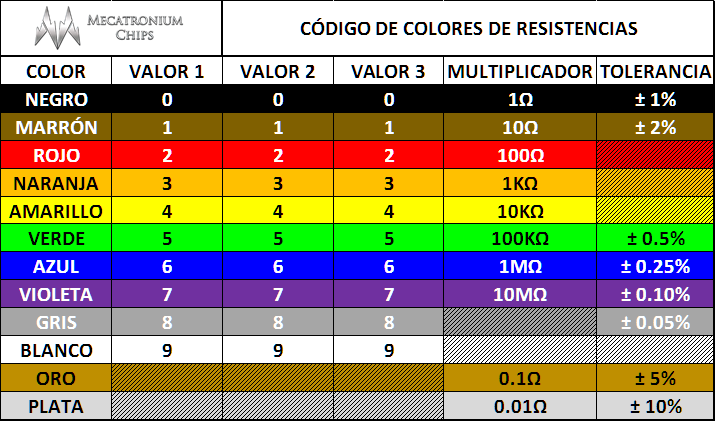

# clase 04

- Como funciona la ley de ohm


- Código de color de resistencias



- Como reconocer la polaridad de un LED


- Armar el primer circuito con un LED en el pin 13 (Luego lo cambiamos a pin 7 o 9, según el caso)


- Uso de potenciómetro


- Usamos map(); para cambiar rangos en Arduino
<https://docs.arduino.cc/language-reference/en/functions/math/map/>

- Aprendimos a usar millis(); para controlar el parpadeo de un led sin usar delay <https://docs.arduino.cc/language-reference/en/functions/time/millis/>

- Controlamos el brillo de un led con PWM (esto debe ser solo en pines que tengan el símbolo de virgulilla ~)

## Encargo 4

- Traer pantalla OLED de 0.96"

- Van a usar la estructura if para alterar el brillo del led a otros comportamientos. Por ejemplo, si el potenciometro mide hasta 100, que la intensidad sea maxima, si mide entre 100 y 500, que sea intensidad media, etc.

Ejemplo:

```cpp
if (valorPot < 100)
    {
    	intensidadLed = 255;
    } 
  
  	if (valorPot >= 100 && valorPot < 200)
    {
    	intensidadLed = 255;
    } 
```

