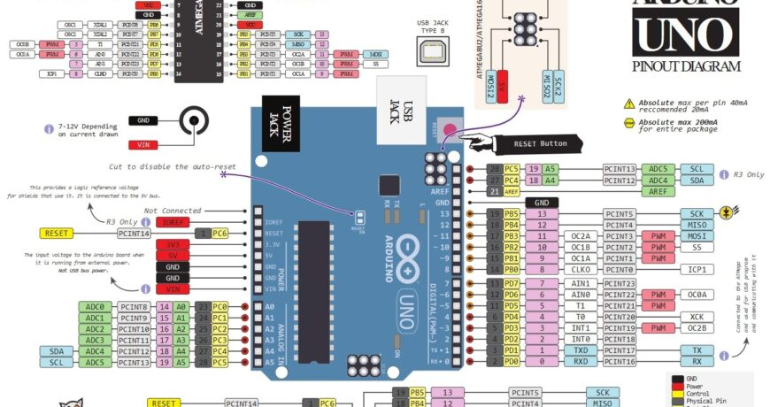

# clase 05

## Apuntes clase

- Aprendimos a usar arrays y ciclos for en [miPrimerArray](./miPrimerArray/) y [miArrayPoetico](./miArrayPoetico/)
- Aprendimos a instalar bibliotecas
- Aprendimos a usar una pantalla OLED con texto en [miPrimeraPantallaOLED-096](./miPrimeraPantallaOLED-096/), [pantallaOled-conscroll](./pantallaOled-conscroll/) 
- Aprendimos a poner imágenes en la pantalla vía [image2cpp](https://javl.github.io/image2cpp/) y [miPrimeraImagen-enOLED](./miPrimeraImagen-enOLED/)

## Pines del arduino (ojo con A4 y A5)



## Recursos utilizados

- Guía de AFEL https://afel.notion.site/Gu-a-de-Uso-de-Pantalla-OLED-0-91-128x32-con-Arduino-Modo-I2C-22d955fd4214802b998fe3ac8c37e30f
- Utilizamos la librería [Adafruit SSD1306](https://github.com/adafruit/Adafruit_SSD1306)
- Todas las librerías de Arduino están accesibles [aquí](https://github.com/arduino/library-registry/tree/main)


## Encargo para primera nota

- Construir en una pantalla OLED una proyección de una frase que se adapte a lo largo del tiempo. Puede ser utilizando imágenes, scroll, palabra por palabra, etc. Ayudarse de arrays y ciclos for para incorporar palabras.
- La próxima semana (11 de septiembre) es posible que la clase se de vía online, donde revisaremos cada bitácora
- La primera nota también tiene un porcentaje de todos los encargos hasta ahora

### Pre apuntes para clase

revisar para pantalla oled
https://javl.github.io/image2cpp/

referentes: allison parrih ([texto](https://posts.decontextualize.com/queer-in-ai-2021/)) y nick montfort (Libro output: an anthology of computer-generated text), <https://poesiacero.cl/>, <https://martingubbins.cl/obra/>

___

Código base para trabajar con pantallas OLED 0x96" i2c  (generado por chatgpt)

```cpp
#include <Wire.h>
#include <Adafruit_GFX.h>
#include <Adafruit_SSD1306.h>

// Definir tamaño del display
#define ANCHO_PANTALLA 128
#define ALTO_PANTALLA 64

// Dirección I2C típica (0x3C o 0x3D)
#define OLED_ADDR 0x3C  

// Crear objeto display
Adafruit_SSD1306 display(ANCHO_PANTALLA, ALTO_PANTALLA, &Wire);

void setup() {
  // Iniciar la pantalla
  if(!display.begin(SSD1306_SWITCHCAPVCC, OLED_ADDR)) {
    Serial.begin(9600);
    Serial.println(F("No se encontró pantalla SSD1306"));
    for(;;); // se queda detenido
  }

  display.clearDisplay();             // limpiar buffer
  display.setTextSize(2);             // tamaño del texto
  display.setTextColor(SSD1306_WHITE);// color del texto
  display.setCursor(10, 25);          // posición (x,y)
  display.println("Hola mundo");      // escribir texto
  display.display();                  // mostrar en pantalla
}

void loop() {
  // nada que hacer en loop
}

```

